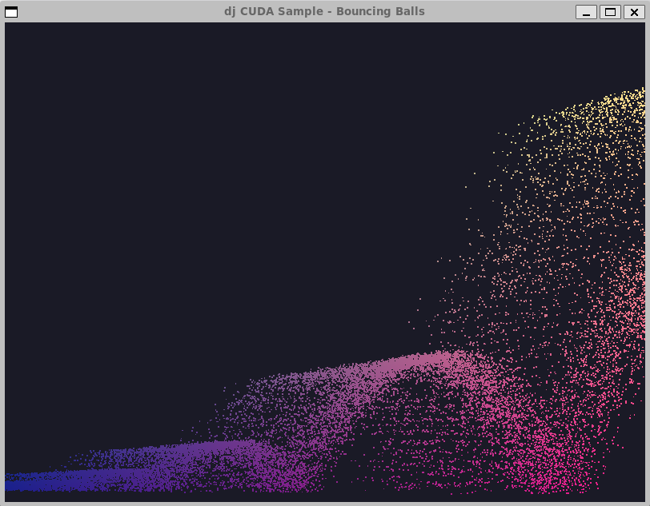

# dj CUDA Samples



A growing collection of small CUDA cross-platform learning samples by David Joffe, starting with a simple GPU-accelerated bouncing-balls demo using CUDA + OpenGL via GLFW.

[CUDA Sample(s)/demo by David Joffe](https://github.com/davidjoffe/dj-cuda-samples)

* [LinkedIn](https://www.linkedin.com/in/david-joffe-50771b4/)

## Samples:

* Simple bouncing ball sample/demo
* [`Molecular Sim`](samples/molecular_sim) (beta, in development)
* [`Galaxy Explorer`](samples/galaxy_explorer) Galaxy Explorer (in development)
* Templates

Platforms: Windows; Linux/WSL; (macOS in development)

### 🔹 Molecular Simulation
A GPU-accelerated molecular dynamics sandbox using Lennard-Jones interactions and Velocity Verlet integration, with real-time visualization.

- 100,000 particles in real time
- CUDA force computation
- Interactive OpenGL rendering
- Early-stage but physically motivated behavior (clustering, evaporation, dispersion)

See [`samples/molecular_sim`](samples/molecular_sim) for details.

## Requirements

* Requires NVIDIA CUDA toolkit installed (e.g. via winget or NVIDIA installer).

To install via winget, use ```winget install Nvidia.CUDA```

* CMake 3.2
* OpenGL + GLFW3 dev packages
* A modern NVIDIA GPU with CUDA support

## Build

First install dependencies, as per below instructions.

Then to build on Windows, configure and run ```.\build.bat``` build helper, or:

```
cmake -S . -B build-windows -DCMAKE_TOOLCHAIN_FILE=c:/your-vcpkg-folder/scripts/buildsystems/vcpkg.cmake
cmake --build build-windows
```

To build on Linux, either run ```./build.sh```, or:

```
cmake -S . -B build-linux
cmake --build build-linux
```

## Run (Windows)

```
.\build-windows\samples\bouncing_balls\Debug\djbouncing_balls.exe

.\build-windows\samples\bouncing_balls\Release\djbouncing_balls.exe

.\build-windows\samples\molecular_sim\Release\djmolecular_sim.exe
```

## Run (Linux)

```
./build-linux/samples/bouncing_balls/djbouncing_balls
./build-linux/samples/molecular_sim/djmolecular_sim
```

## Help

### **Keys**

```
    P     Pause/Unpause
    Z,X   Zoom in / Zoom out (molecular sim)
    ESC   Exit
```

### **Command-line Options**

```
   --paused   Start paused
   -N / --n   Number of particles/entities (default 100,000)
   -f / --fullscreen  Fullscreen mode
   -M  --maxframes N    Exit after N frames (default: unlimited)
   --headless           Headless mode (no graphics)
   --rate R             Optional fixed/deterministic simulation update rate (updates per second)
```

To give some guideline, on a GPU such as an NVIDIA RTX 4060, it can smoothly handle over 1,000,000 particles / bouncing balls.

### Installing Dependencies:

This uses glfw to create a window with OpenGL context.

#### Windows

* glfw3

Windows: Install glfw3 with vcpkg:

```
vcpkg install glfw3:x64-windows
```

Make sure your vcpkg installation is integrated: ```vcpkg integrate install```

#### Linux, WSL etc.:

```
sudo apt install libglfw3-dev
```

## Troubleshooting

If you get a build error about glfw3 cmake config not found, first try set your VCPKG folder in build.bat. Alternatively pass " -DCMAKE_TOOLCHAIN_FILE=" to cmake. 

For Windows, you should build from a Developer Command Prompt for VS.

## Docker (Optional)

If running in a Docker container it automatically falls back to headless mode, runs a fixed number of simulation steps, then exits.

Note Docker support is completely **optional**.

It provides an alternative, additional way to build and run the CUDA samples — useful for deployment, reproducible builds, or testing.

## Docker Build and Run

The provided Dockerfile builds the CUDA sample inside a GPU-enabled container. It currently has no User Interface unless you forward X11 or VirtualGL.

It requires the NVIDIA Container Toolkit to be installed - see the NVIDIA guide for installing this.

Note that if you have installed the NVIDIA Container Toolkit but still get a warning about the driver failing to load when you run the Docker version in Docker Desktop, try run from command line as per below to force GPU support via command line:


```docker build -t dj-cuda-sample1:local -f .\samples\bouncing_balls\docker\Dockerfile .```

```docker buildx build --compress --progress=plain -t dj-molecular-sim:local -f .\samples\molecular_sim\docker\Dockerfile .```


```
docker run --gpus all --runtime=nvidia dj-molecular-sim:local
docker run --gpus all --runtime=nvidia dj-cuda-sample1:local
```

## License

dj-cuda-samples is released under the Business Source License 1.1 (BSL). See LICENSE file for details.

This is a source-available license: you may read, modify, and use the code for non-commercial, non-production purposes.

Any commercial, production, or revenue-generating use requires permission or a commercial license from DJ Software.

This can include simple, low-cost arrangements or small-scale consulting engagements — the goal is to keep things flexible and accessible for individuals, indie developers, and researchers, while reserving larger commercial rights, and maintaining the ability to offer professional support (and/or training).

Copyright © 2025 David Joffe and DJ Software.

## How to Obtain a Commercial License or Support

If you would like to use **dj-cuda-samples or any derivative work** in a production, commercial, or revenue-generating context, please contact DJ Software for permission or a commercial license.

Licensing is kept **flexible and accessible**.

For small independent developers, researchers, or hobby projects, commercial exceptions can often be granted through simple low-cost arrangements such as purchasing consulting time (such as support, training, or customization work) or a once-off small fee. For larger organizations, studios, or production deployments, full commercial licensing and support options are available.

📧 Contact

**David Joffe — DJ Software**
Email: davjof@gmail.com

When contacting, please include a brief description of your intended use so we can determine the simplest and most appropriate option for you.

Commercial licensing and support help fund ongoing CUDA, GPU, and simulation research and development.

## Roadmap

The long-term direction for dj-cuda-samples is to grow from small, focused CUDA demonstrations into a broader ecosystem of high-performance GPU tools and experiments. Upcoming samples will highlight both foundational CUDA techniques and more advanced topics such as molecular simulation, procedural generation, and distributed GPU compute.

## Vision

The goal of this project is to create GPU-accelerated building blocks that can scale into genuinely meaningful, high-impact applications. Beyond graphics and gamedev, GPUs today underpin important work in:

* aging and longevity research
* molecular simulation and drug discovery
* large-scale AI and scientific modelling
* space exploration

My intention is to grow dj-cuda-samples into a foundation from which more ambitious tools can emerge — systems that help move humanity forward.

I’m also open to working with organizations or individuals who share these goals, whether through collaboration, sponsorship, consulting, or applied research partnerships.
